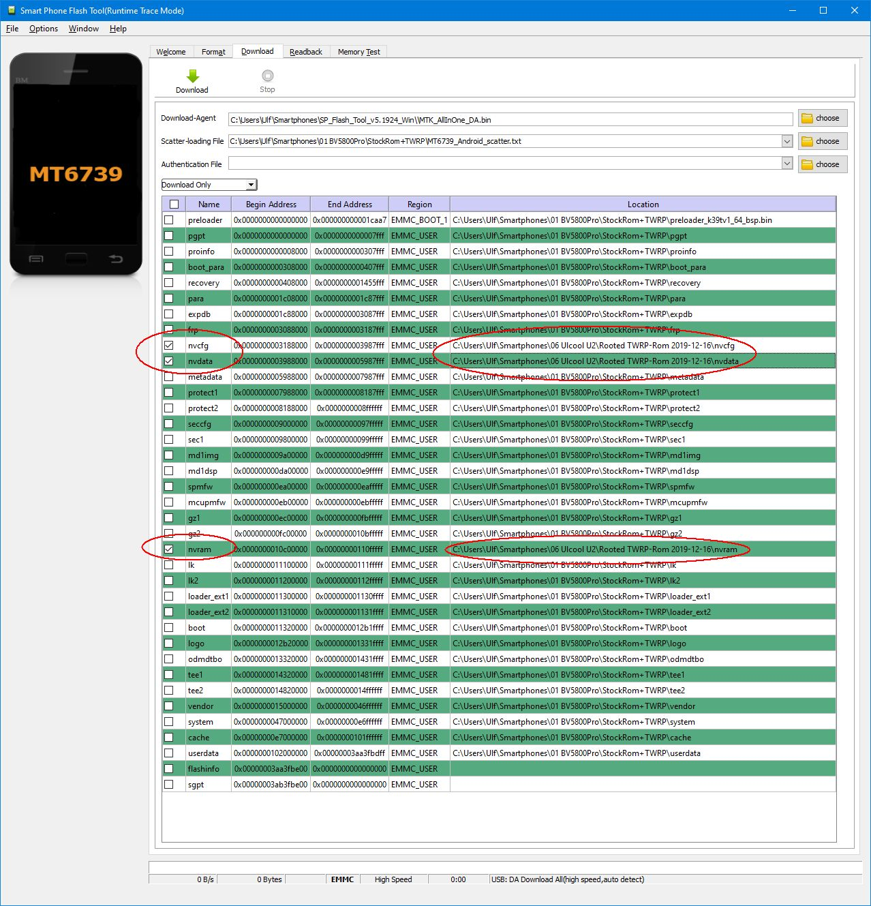

# Kontinuierliche Glukose-Anzeige des Libre 2 auf Smartphone ohne NFC

## 1. Einleitung 
Mit dem Libre 2 Sensor werden minütlich die Glukosewerte
zu einem Empfangsgerät übertragen.

Die Standardlösung von Abbott mit der originalen LibreLink App erlaubt dabei, dass auf dem Smartphone Alarme ausgelöst werden können.
Der Benutzer sieht aber keine Werte - dafür muss er mit dem NFC-fähigen Smartphone oder dem Lesegerät scannen.
Findige IT-Spezialisten haben die LibreLink App so verändert, dass man die Werte, die ja sowieso minütlich auf dem Smartphone von der LibreLink App empfangen werden, an xDrip+ weitergeleitet wrden können.
Dort werden sie (regulär im 5-Minuten-Takt, in einer zusätzlichen Detailansicht aber auch mit den minütlichen Werten) kontinuierlich angezeigt.
 
Damit das funkioniert, muss dieses Smartphone NFC haben. Denn der Libre 2 sendet die minütlichen Werte per Bluetooth nur an das Smartphone (oder Abbott-Lesegerät), mit dem er gestartet wird.
Deshalb darf man den Libre 2 auch nicht mit dem Lesegerät starten, wenn man die Werte kontinuierlich auf dem Smartphone haben will. Nur das Startgerät erhält die kontinuierlichen Werte.

Nun haben wir bei uns seit 2 Jahren speziell bei unserer Tochter, aber auch bei mir selbst, möglichst Mini-Lösungen in Betrieb.

Im Grunde soll (und kann auch!) eine Full Android Smartwatch (wie sie von Herstellern wie Kospet, Finow, Lemfo, Microwear, Zeblaze und anderen angeboten wird) den Empfang der Glukosewerte vom Sensor erledigen.

Zusätzlich soll dann unsere Pumpe im Closed Loop gesteuert werden. Leider ist das von uns verwendete AndroidAPS nicht auf einer Full Android Uhr bedienbar, weshalb wir im Moment Miniphones einsetzen.

Wir haben also jetzt das Melrose 2019 bei meiner Tochter und das Ulcool U2 bei mir in Betrieb.

Diese Miniphones sind wunderbar für das Diabetes-Management. Sie haben für den Libre 2 nur einen Fehler: Sie haben kein NFC. Also können sie den Libre 2 nicht starten.

Mit etwas technischem Aufwand ist es jedoch möglich, den Libre mit einem NFC-fähigen Smartphone zu starten und die damit erstellte Bluetooth-Verbindung vom Starter-Handy auf das Miniphone ohne NFC zu übertragen.

## 2. Warum nicht ein normales Smartphone verwenden?
Unsere Tochter ist 6 Jahre alt und soll vom Diabetes so wenig wie möglich merken.

Da wir loopen (also die Sensor-Werte mit Hilfe eines Programms zur automatischen Steuerung der Insulinpumpe verwenden), brauchen wir entsprechende Hardware. Und die muss so klein und unmerkbar wie möglich sein.

Idealerweise würde unsere Tochter eine Full Android Uhr im Bauchband haben, aber noch ist das Miniphone die am besten handhabbare Lösung.

Ein normales Smartphone würde immer irgendwo liegen bleiben. Ein Miniphone wie das Melrose 2019, das Ulcool U2 oder einige andere (Soyes, Anica, Melrose und Ulcool sind die vier mir bekannten Miniphone-Marken) lässt sich gut in eine Tasche im Bauchband zur Pumpe stecken und ist dann immer dabei.

## 3. Gibt es keine Miniphones mit NFC?
Mir bekannt ist nur ein aktuelles: Das Unihertz Atom. Das ist mit 250€ aber sehr teuer. Und es ist dicker und schwerer als das Melrose 2019.

Die chinesischen Miniphones wie die von uns verwendeten liegen im 70€-100€ Bereich. Und das von uns für unsere Tochter präferierte Melrose 2019 ist nur halb so dick wie das Atom und 40g leichter.

## 4. Was brauche ich?
- Ein Smartphone mit Mediatek (MTK) Prozessor mit NFC, das zum Starten des Libre 2 verwendet wird. Es geht sicherlich auch mit einem Qualcomm Prozessor, das benötigt aber andere Software und wurde von mir nicht getestet.
- Das Miniphone (ohne NFC) mit Mediatek (MTK) Prozessor, mit dem ich die Werte dann kontinuierlich bekomme. Zum Prozessor gilt das vorher gesagte.
- Ein passendes USB-Kabel für jedes der beiden Smartphones, um es mit dem PC zu verbinden. 
- Einen PC
- Die PC-Programme [WwR MTK](./WWR_MTK_2.51.zip) und [SP Flash Tool](./SP_Flash_Tool_v5.1924_Win.zip) sowie die [MTK Preloader Treiber](./MTK_USB_All_v1.0.8.zip). Die hier verlinkten Dateien sind die zum Erstellungszeitpunkt neuesten, die ich gefunden und bei mir installiert habe. Möglicherweise gibt es jetzt neuere. Bitte selbst nach Aktualisierungen suchen.
- Die gepatchte LibreLink. Diese muss allerdings noch zusätzlich mehr
  gepatcht werden, damit sie auch auf einem Smartphone ohne NFC läuft.
  Die Anleitung für den grundsätzlichen Patch findet man im Original
  (englisch) [hier](https://github.com/jcwarrior/Libre2-patched-App). 
  
  Tino Kossmann hat für ein Linux-System daraus einen automatisierten
  Patch-Ablauf gemacht, den man
  [hier](https://github.com/TinoKossmann/LibreLink-xDrip-Patch) findet.
  Allerdings ist hier meine manuelle Änderung nicht eingearbeitet, so
  dass die so erstellte APK nicht auf dem Miniphone ohne NFC läuft.
  Derzeit muss nach der englischen Original-Anleitung vorgegangen
  werden.
- Die "Android Debug Bridge", kurz ADB, auf dem PC. Dieses Programm wird
  automatisch mit installiert, wenn man das Android Studio installiert.
  Wer sich also AndroidAPS selbst baut, der hat das auf jeden Fall auf
  dem PC. [Android Studio kann man sich von Google herunterladen und
  installieren](https://developer.android.com/studio). Wem das zu
  viel ist, der kann nach "minimal adb" suchen und sich nur dieses
  herunterladen (da ist dann auch noch fastboot dabei, aber das
  benötigen wir nicht).
## 5. Vorbereitung
### 5.1. Auf dem PC
Die Programme WWR MTK und SP Flash Tool müssen in einen Ordner entpackt werden, die MTK Treiber müssen installiert werden.
### 5.2. Auf den beiden Smartphones
Die Entwickleroptionen müssen angeschaltet werden und "USB Debugging" muss aktiviert werden.
- Um die Entwickleroptionen anzuschalten, geht man in den Android Einstellungen des Smartphones typischerweise in die "System"-Seite, dort "Über das Telefon" und dann tippt man mehrere Male auf "Build-Nummer". Wenn man das oft genug gemacht hat, erscheint eine Meldung, die etwa besagt "Sie sind jetzt Entwickler".
Danach ist in den Einstellungen normalerweise auf der "System"-Seite ein neuer Eintrag "Entwickler-Optionen" sichtbar. Bei einigen Smartphones (wie meinem Xiaomi Mi9SE) sind die "Über das Telefon"-Seite und die "Entwickler-Optionen" an anderer Stelle in den Android Einstellungen aufgeführt. Das mag also bei einigen Smartphones etwas anders gestaltet sein als hier beschrieben.
- Sind die Entwickleroptionen angeschaltet, geht man in diese Seite in
  den Einstellungen. Dort findet man den Schalter für "USB-Debugging".
  Der muss angestellt werden.
- xDrip+ wird installiert (ich nehme da in der Regel den neuesten
  [Nightly Build](https://github.com/NightscoutFoundation/xDrip/releases)).
  Die Datenquelle muss in beiden auf LibreLink (patched) konfiguriert
  werden. Auf dem NFC-Handy ist xDrip+ im Grunde nicht nötig, ist aber
  erstmal nach der Aufwärmzeit ein guter Indikator, dass es
  funktioniert.
- Nachdem 6.1 durchgeführt wurde, kann man auf beiden Smartphones
  bereits die gepatchte LibreLink installieren.

## 6. Durchführung 

### 6.1. Erweitertes Patchen der LibreLink
#### Nach der englischen Originalanleitung
Man führt die Patch-Anleitung normal aus. Bevor man aber den Punkt "Rebuild the APK" durchführt, ändert man von Hand noch eine Datei.
Diese befindet sich im Patch-Verzeichnis im Unterverzeichnis "`librelink\smali_classes2\com\librelink\app\util`". Hier die Datei `NfcUtils.smali` mit einem Text-Editor öffnen.

Man sieht hier drei Methoden (die Zeilen beginnen mit `.method`, die Methode endet dann mit `.end method`). Die letzten zwei Methoden `isNfcEnabled` und `ìsNfcSupported` müssen geändert werden, so dass der gesamte Text dieser Methoden so aussieht:

    .method public static isNfcEnabled(Landroid/content/Context;)Z
        .locals 0

	    const/4 p0, 0x1
	    return p0
    .end method
    
    .method public static isNfcSupported(Landroid/content/Context;)Z
        .locals 0

        const/4 p0, 0x1
        return p0
    .end method `

Wenn diese Textänderung vorgenommen wurde, wird die Datei gespeichert
und man kann mit dem Punkt "Rebuild the APK" fortfahren.

Diese so veränderte LibreLink läuft nun auch auf Smartphones ohne NFC.
Natürlich kann sie auf einem Smartphone ohne NFC den Libre trotzdem 
nicht scannen. 

Für das Smartphone mit NFC macht diese Änderung keinen
merkbaren Unterschied, hier wird die LibreLink ganz normal
funktionieren.

Auf beiden Smartphones kann die gepatchte LibreLink jetzt installiert
werden.

#### Nach der deutschen Anleitung von Tino Kossmann
Noch nicht implementiert.

### 6.2. Backup der Smartphone-ROMs
Das Backup der Smartphones muss natürlich getrennt voneinander
stattfinden. Ich beschreibe hier den grundlegenden Vorgang. Für jedes
Smartphone muss ein eigenes Verzeichnis angelegt werden, in dem das
ROM-Backup gespeichert wird. Diese beiden Verzeichnisse dürfen nicht
vermischt werden und sollten so gesichert werden, dass ein Rückspielen
auf das zugehörige Smartphone jederzeit möglich ist.

**Insbesondere ist zu beachten, dass die individuellen Parameter des
NFC-Smartphones (IMEI, Wlan-MAC, Bluetooth-MAC, etc.) in Folge mit denen
des Nicht-NFC-Miniphones überschrieben werden! Damit entstehen zwei
Smartphones, die für einen Telefonie-Provider, das Wlan oder andere
Bluetooth-Geräte völlig gleich aussehen, was bei gleichzeitigem Betrieb
ziemlich sicher Probleme verursachen wird. Damit das NFC-Smartphone
wieder in seinen originalen Zustand zurückversetzt werden kann, ist eine
Sicherung seines ROMs, besonders der individualisierenden Teile,
unbedingt notwendig!**

#### 6.2.1. Extrahieren des Preloaders 
Ich bin dazu nach
[dieser Anleitung](https://forum.hovatek.com/thread-21970.html)
vorgegangen, allerdings nur bis inklusive Schritt 16. Die nachfolgenden
Schritte konnte ich nicht durchführen, weil der dann folgende RAM-Test
zur Ermittlung der Partitionen nicht in der vorgegebenen Form im SP
Flash Tool angeboten wurde. Es gibt dafür aber eine alternative
Vorgehensweise, die im folgenden durchgeführt wird.

#### 6.2.2 Extrahieren des gesamten ROMs und Aufspalten in Partitionen
Hierfür bin ich nach
[dieser Anleitung](https://forum.hovatek.com/thread-22701.html)
vorgegangen. Diesmal habe ich die Schritte 1 bis 7 durchgeführt. Nach
Schritt 7 wiederholt man Schritt 1, jetzt aber mit der Länge, die man in
Schritt 7 erfahren hat und nicht nur mit den ersten 0x80000 Bytes, wie
ursprünglich in Schritt 1 durchgeführt.

Dann bin ich wieder zur
[Anleitung aus 6.2.1](https://forum.hovatek.com/thread-21970.html)
zurückgekehrt und habe dort von Schritt 20 ab fortgesetzt. Am Ende von
Schritt 29 hat man in dem gewählten Verzeichnis nun das gesamte ROM des
Smartphones.

Das muss man für beide Smartphones durchführen.

### 6.3 Rooten beider Smartphones

#### 6.3.1 Übertragen von Dateien auf das Smartphone
Bevor auf den Smartphones das zum Rooten nötige Recovery Image
aufgespielt wird, empfiehlt es sich, die Installationsdateien für die
eigentliche Root-Software auf das Smartphone zu übertragen. Ich habe in
beiden Smartphones eine SD-Karte, auf die ich den
[Magisk Manager](https://magiskmanager.com/) geladen habe. Dieser
besteht aus einem ZIP-File mit der Root-Software und einer APK-datei, in
der (nach deren Installation) die Verwaltung im Normalbetrieb dann
erfolgt

#### 6.3.2 TWRP-Recovery flashen
Für das Rooten habe ich auf beiden Smartphones eine passende
TWRP-Recovery aufgespielt. Das kann für nicht von TWRP von sich aus
unterstützte Smartphones (wie das Melrose 2019 oder das Blackview 5800
Pro) etwas kompliziert sein. Auf
[unofficialtwrp.com](https://unofficialtwrp.com) kann man einiges
finden. Für die von mir verwendeten Smartphones stelle ich [hier für das
Melrose 2019](./Melrose%202019/recovery.img) ,
[hier für das Ulcool U2](./Ulcool%20U2/recovery.img) und [hier für das
Blackview BV5800 Pro](./Blackview%20BV5800%20Pro/recovery.img) die
recovery-Images bereit.

Das Aufspielen der recovery images habe ich nicht mit der
fastboot-Methode gemacht, sondern mit dem SP Flash Tool, mit dem dann
nur diese Recovery-Partition geschrieben wird. [Dazu startet man das SP
Flash Tool, wählt als Scatter-File das für das Smartphone bei 6.2.2
erstellte an und wählt unbedingt alle Partitionen ab, nur die recovery
Partition bleibt angewählt. Man kann die TWRP-Recovery-Partition
natürlich in das ROM-Verzeichnis hineinkopieren (Achtung! Dann
überschreibt man die originale recovery.img! Diese sicherheitshalber
woanders hinkopieren!)). Oder man speichert die TWRP-recovery-Datei an
einem anderen Ort, dann klickt man im SP Flash Tool in der Location
Spalte auf den Recovery-Eintrag und wählt die TWRP-Datei aus.

Das Smartphone muss ausgeschaltet sein und vom PC getrennt sein.

Im SP Flash Tool muss in der Combobox über der Partitionsliste "Download
Only" stehen. Nun klickt man im SP Flash Tool auf "Download" (grüner
abwärtszeigender Pfeil). Jetzt schließt man das ausgeschaltete
Smartphone an den PC an. Die recovery-Partition wird nun mit der
TWRP-recovery überschrieben.
 
Danach wird das noch ausgeschaltete Smartphone vom PC getrennt und
direkt in die Recovery gestartet. Tut man das nicht, sondern startet das
Handy erst wieder normal, wird bei vielen eine Sicherheits-Recovery
wieder über das TWRP überspielt. So wäre dann das TWRP-Aufspielen
umsonst gewesen. In der Regel drückt man dazu die Ein/Aus-Taste
gemeinsam mit der Lautstärke+ Taste lange, bis ein spezieller
TWRP-Recovery-Bildschirm erscheint.

#### 6.3.3 Magisk Manager installieren
Nun folgt das Installieren des Magisk Managers. Das ist an vielen
Stellen beschrieben, bitte nach "twrp root magisk" suchen und eine
Anleitung befolgen.

## 7 NFC-Smartphone wie das Miniphone ohne NFC aussehen lassen
Nun sollten beide Smartphones gerootet sein.

### 7.1 Miniphone Bluetooth-Konfiguration auslesen
Nachdem alle Schritte aus 6 mit beiden Smartphones durchgeführt wurden
(noch können dabei beide gleichzeitig angeschaltet sein), wird das
Miniphone ohne NFC angeschaltet, falls es nicht schon an ist. Es wird
mit dem USB-Kabel mit dem PC verbunden. Wie schon in 5.2 beschrieben,
müssen die Entwickleroptionen eingeschaltet sein und "USB Debugging"
muss in den Entwickleroptionen aktiviert sein.

#### 7.1.1 Shell auf Miniphone öffnen
Man öffnet ein Kommando-Fenster und gibt `adb shell` ein und bestätigt
mit `<Return>`. Dabei sollte das Miniphone das einzige verbundene sein,
ansonsten muss man genauer spezifizieren, mit welchem Smartphone sich
ADB verbinden soll.

#### 7.1.2 Root in der shell werden
Nun befindet man sich in der Kommandozeile auf dem Smartphone. Hier wird
`su` eingegeben und mit `<Return>` bestätigt.

Jetzt erscheint auf dem gerooteten Smartphone ein Dialog, auf dem man
bestätigen muss, dass man mit der Shell auch Root-Zugriff bekommen darf.
Das bestätigt man. Dieser Vorgang ist einmalig, danach kann man den
Befehl `su` immer ausführen, ohne das erneut bestätigen zu müssen.

#### 7.1.3 bt_config.conf auf PC übertragen
Nun mit `cd /data/misc/bluedroid` und `<Return>` in das
Konfigurationsverzeichnis für Bluetooth wechseln. Dieser Speicherbereich
ist normalerweise nicht zugänglich, nur für root.

Hier sollte eine Datei "bt_config.conf" existieren. Sollte das nicht der
Fall sein, hier in der shell einmal `am force-stop
com.android.bluetooth` und `<Return>` eingeben, danach in den Android
Einstellungen Bluetooth anschalten. Nun ist die Datei "bt_config.conf"
erzeugt. In dieser stehen Schlüssel für die Bluetooth-Kommunikation.
Diese Datei vom Miniphone muss zum Starten auf dem NFC-Smartphone
verwendet werden, damit die Kommunikation beim Starten mit genau der
Verschlüsselung abläuft, die das Miniphone versteht.

Dazu wird diese "bt_config.conf" erstmal auf den öffentlichen Speicher
des Smartphones kopiert. Das kann unter /storage/sdcard (bei nur
internem Speicher) oder auch /storage/sdcard0 oder /storage/sdcard1
sein. Das Kommando zum Kopieren ist `cp /data/misc/bt_config.conf
/storage/sdcard/`, wobei das `sdcard` eben eventuell durch den auf dem
eigenen Nicht-NFC-Smartphone existierenden Namen ersetzt werden muss.

Danach verlässt man die root shell mit `exit` und `<Return>`, dann noch
einmal `exit` und `<Return>` zum Verlassen der adb shell auf dem Handy.

Nun ist man wieder auf der Kommandozeile des PC. Hier gibt man ein `adb
pull /storage/sdcard/bt_config.conf`, dabei ist der Pfad mit sdcard
wieder gegebenenfalls durch sdcard0 oder sdcard1 zu ersetzen. Die
bt_config.conf Datei des Miniphones ohne NFC sollte nun im aktuellen
Verzeichnis auf dem PC liegen.

Jetzt kann das Miniphone erstmal ausgeschaltet werden. Nicht einfach nur
kurz den Ein/Aus-Schalter drücken, sondern das Miniphone nach langem
Drücken auf Ein/Aus mit dem Punkt "Herunterfahren" komplett ausschalten.
Bei den weiteren Schritten wird das NFC-Phone quasi zum Miniphone
gemacht, deshalb sollten dann nicht mehr beide gleichzeitig angeschaltet
sein.

### 7.2 NFC-Phone mit der Netzwerk-Konfiguration des Miniphones ausstatten
Jetzt wird das NFC-Phone sozusagen zum Miniphone gemacht.

#### 7.2.1 Individuelle Konfiguration auf das NFC-Phone flashen
**Warnung: Im folgenden werden drei Partitionen auf den NFC-Phone mit
denen des Miniphones überschrieben. Hierbei ist sicherzustellen, dass
die Partitionsgrößen gleich sind. Nach dem Backup der Firmware (6.2)
sind in jedem Backup-Verzeichnis die Paritions-Dateien. Es ist zu
überprüfen, dass die Dateien nvcfg, nvdata und nvram (eventuell mit
Datei-Erweiterung ".img") vom Miniphone nicht größer sind als vom
NFC-Phone!**

Das NFC-Phone bleibt noch ausgeschaltet. Im SP Flash Tool wird
jetzt die Scatter-Datei des NFC-Phones geladen. Im Download-Fenster
werden alle Häkchen außer bei nvcfg, nvdata und nvram weggemacht. In
diesen drei Zeilen klickt man auf den Location-Bereich und wählt dann
die entsprechenden Dateien aus dem Miniphone-Verzeichnis aus.

Das ganze sollte dann so aussehen:

In der Combobox muss wieder "Download Only" stehen. Dann kann man auf
den Download-Knopf klicken und das (immer noch ausgeschaltete!)
NFC-Smartphone mit dem USB-Kabel anschließen.

Nach Abschluss des Flashens ist das NFC-Handy nun für Bluetooth, Wlan
und Telefonie praktisch das Miniphone, ab jetzt dürfen beide nicht mehr
gleichzeitig angestellt werden.

#### 7.2.2 bt_config.conf auf das NFC-Handy spielen
Das Miniphone bleibt weiterhin aus. Das NFC-Handy kann jetzt
angeschaltet werden. Es wird weiter mit dem PC verbunden. Auch hier muss
wieder USB-Debugging in den Entwickleroptionen angeschaltet sein.

Im vorher schon benutzten Kommando-Fenster auf dem PC gibt man jetzt ein
`adb push bt_config.conf /storage/sdcard` und `<Return>`, wobei für
"sdcard" das gleiche gilt wie vorher beim Export der
bt_config.conf-Datei vom Miniphone.

Danach `adb shell` und `<Return>` eingeben.

Dann wieder mit `su` zu root werden (alles findet analog zum Miniphone
vorher statt, ich verzichte daher auf weitere Hinweise bezüglich der
Pfade mit sdcard/sdcard0/sdcard1).

Jetzt den Befehl `cp /storage/sdcard/bt_config.conf
/data/misc/bluedroid/` und `<Return>` eingeben.

Nun den Befehl `chown bluetooth:bluetooth
/data/misc/bluedroid/bt_config.conf` und `<Return>` eingeben.

Jetzt Bluetooth einmal mit dem Befehl `am force-stop
com.android.bluetooth` stoppen.

Danach Bluetooth in den Android Einstellungen wieder anschalten.

Jetzt ist das NFC-Phone vorbereitet, um den Libre 2 zu starten.

## 8 Starten des Libre 2

Das Miniphone ist immer noch aus.
 
Mit dem NFC-Handy wird mittels der installierten LibreLink nun der Libre
2 gestartet.

Nach der einen Stunde Aufwärmzeit habe ich überprüft, dass in xDrip+ auf
dem NFC-Handy Werte kamen. Das war der Fall.

## 9 Übertragen der LibreLink Daten vom NFC-Handy auf das Miniphone

### 9.1 Backup der LibreLink-Daten vom NFC-Handy

Das Miniphone ist immer noch aus.
 
Das NFC-Handy wird wieder mit dem USB-Kabel an den PC verbunden.

Im Kommando-Fenster wird das Kommando eingegeben `adb backup -f
librelink.backup com.freestylelibre.app.de` und `<Return>`. Der Name
`librelink.backup` kann dabei frei gewählt werden.

Nun wird das NFC-Handy ausgeschaltet. Auch hier wieder gilt: richtig
herunterfahren, nicht einfach nur kurz den Ein/Aus-Schalter betätigen!

### 9.2 Restore der LibreLink-Daten auf dem Miniphone

Nun kann das Miniphone angeschaltet werden und auch mit dem USB-Kabel
mit dem PC verbunden werden.

Im Kommando-Fenster wird das Kommando eingegeben 

`adb restore librelink.backup`

Hat man vorher einen anderen Namen gewählt, muss
dieser natürlich anstelle von "librelink.backup" geschrieben werden.

## 10

Kaum zu glauben, das war's. Ab jetzt laufen die Bluetooth-Werte vom
Libre 2 auf dem Miniphone ein, obwohl das kein NFC hat und den Libre 2
nicht selbst gestartet hat.

Nach zwei Wochen muss man dann die Schritte 8 und 9 von neuem mit dem
nächsten Sensor durchführen. In dieser Zeit liegt das NFC-Smartphone
ausgeschaltet und unbenutzt herum.

Will man es in der Zeit parallel zum Miniphone nutzen, müssen unbedingt
vorher die NV-Partitionen mit den originalen (vorher weggesicherten)
Partitionen des NFC-Smartphones restauriert werden. Wenn man das tut,
muss man natürlich vor Schritt 8 auch erstmal wieder die NV-Partitionen
des Miniphones wie in Schritt 7.2.1 auf das NFC-Handy bringen.

